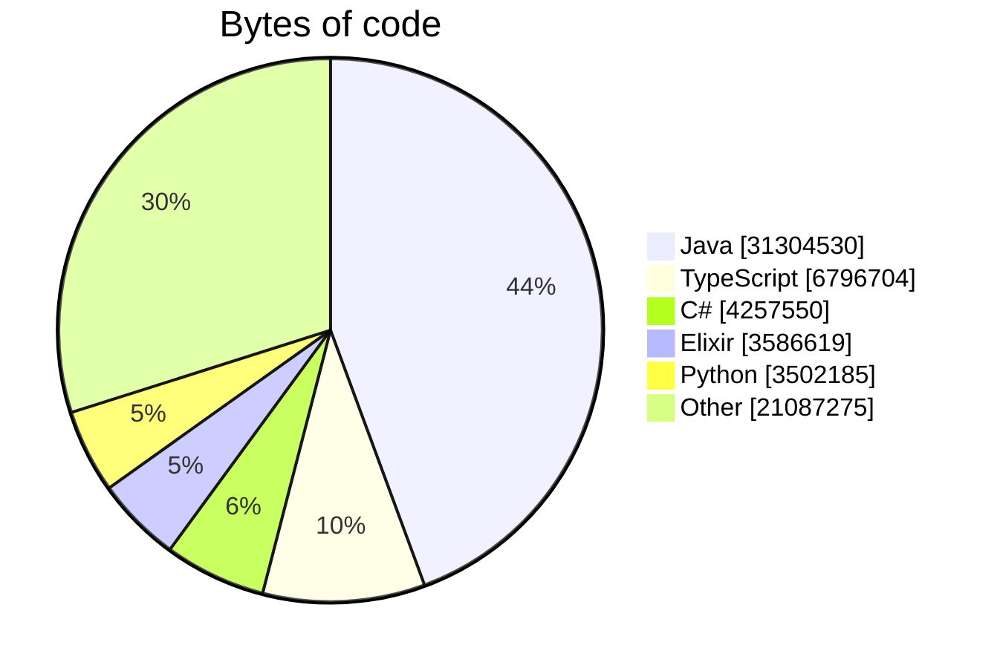
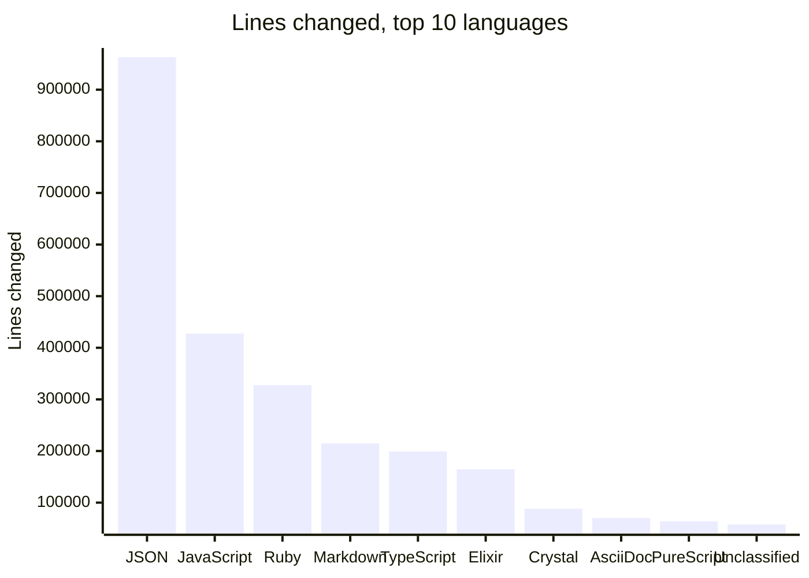

# GitHub default-branch contribution summary

Generated by [langcensus](https://github.com/flix/flix/tree/master/examples/apps/langcensus)
for `wstein`, covering public repositories.

## This run

| | |
| :-- | :-- |
| Commits attributed to | `wstein` |
| Token belongs to | `wstein` |
| Generated | 2026-07-29 11:23:51 UTC |
| Repository scope | public only |
| Repositories examined | 106 |
| Repositories omitted | 0 |
| Commits examined | 5,900 |
| Commit reachability | current default branch only |

## What these numbers are

This report contains **two different measurements over two different populations**.
They are not comparable and should not be added together.

| | Churn by language | Composition by language |
| :-- | :-- | :-- |
| Counts | Lines you added and deleted | Bytes currently in the repository |
| Whose work | Only commits attributed to you | Everyone who ever contributed |
| When | Summed over history | As the repository stands now |

Limitations that affect both:

- Only commits reachable from each repository's **current default branch** are seen.
  Deleted branches, unmerged work and rebased-away history are not counted.
- Only **public** repositories are included. Set `LANGCENSUS_INCLUDE_PRIVATE=true` to count private ones.
- Vendored and generated files are excluded, so lock files and `node_modules` do not dominate.
- A file's language is inferred from its extension, which is ambiguous for some extensions.
- These figures describe activity. They do not measure proficiency, productivity or ownership.

## Overview

| | |
| :-- | --: |
| Repositories with counted commits | 62 |
| Languages you changed | 58 |
| Languages present in those repositories | 52 |
| Lines in files no language claims | 57,563 (2.0%) |
| Lines added | 2,394,575 |
| Lines deleted | 480,285 |
| Bytes of code | 70,534,863 |

## Composition by language — whole repositories, everyone's work

| Language | Bytes | Share |
| :-- | --: | --: |
| Java | 31,304,530 | 44.3% |
| TypeScript | 6,796,704 | 9.6% |
| C# | 4,257,550 | 6.0% |
| Elixir | 3,586,619 | 5.0% |
| Python | 3,502,185 | 4.9% |
| JavaScript | 2,520,096 | 3.5% |
| Ruby | 2,458,497 | 3.4% |
| PureScript | 2,202,989 | 3.1% |
| Go | 1,991,684 | 2.8% |
| Crystal | 1,467,255 | 2.0% |
| Shell | 1,434,078 | 2.0% |
| Scala | 1,432,951 | 2.0% |
| Rust | 1,323,754 | 1.8% |
| C++ | 1,028,139 | 1.4% |
| HTML | 973,458 | 1.3% |
| Swift | 873,956 | 1.2% |
| Kotlin | 702,324 | 0.9% |
| MDX | 647,382 | 0.9% |
| Dart | 587,430 | 0.8% |
| Astro | 338,473 | 0.4% |
| ANTLR | 205,790 | 0.2% |
| CSS | 161,672 | 0.2% |
| GAP | 109,926 | 0.1% |
| C | 101,769 | 0.1% |
| Assembly | 92,577 | 0.1% |
| Perl | 53,197 | 0.0% |
| Lua | 44,185 | 0.0% |
| Vim Script | 41,590 | 0.0% |
| Handlebars | 40,890 | 0.0% |
| PHP | 37,488 | 0.0% |
| CMake | 35,747 | 0.0% |
| Objective-C++ | 28,237 | 0.0% |
| Erlang | 22,741 | 0.0% |
| Makefile | 21,634 | 0.0% |
| Groovy | 18,960 | 0.0% |
| Jupyter Notebook | 18,424 | 0.0% |
| Dockerfile | 13,550 | 0.0% |
| Batchfile | 12,416 | 0.0% |
| Gherkin | 8,937 | 0.0% |
| Nix | 8,368 | 0.0% |
| PowerShell | 6,296 | 0.0% |
| SCSS | 4,781 | 0.0% |
| Awk | 4,527 | 0.0% |
| Meson | 4,156 | 0.0% |
| Smalltalk | 2,453 | 0.0% |
| Dhall | 1,905 | 0.0% |
| Mustache | 1,081 | 0.0% |
| Objective-C | 408 | 0.0% |
| XSLT | 398 | 0.0% |
| Yacc | 364 | 0.0% |
| Fluent | 186 | 0.0% |
| Hack | 156 | 0.0% |

## Churn by language — your commits only

| Language | Added | Deleted | Net |
| :-- | --: | --: | --: |
| JSON | 947,035 | 16,011 | 931,024 |
| JavaScript | 239,681 | 187,783 | 51,898 |
| Ruby | 322,704 | 4,915 | 317,789 |
| Markdown | 154,493 | 60,157 | 94,336 |
| TypeScript | 146,173 | 52,907 | 93,266 |
| Elixir | 131,988 | 32,641 | 99,347 |
| Crystal | 67,823 | 20,235 | 47,588 |
| AsciiDoc | 46,515 | 23,592 | 22,923 |
| PureScript | 48,763 | 14,888 | 33,875 |
| Unclassified | 37,223 | 20,340 | 16,883 |
| Rust | 41,222 | 7,970 | 33,252 |
| Text | 41,346 | 704 | 40,642 |
| Scala | 34,401 | 5,598 | 28,803 |
| HTML | 24,536 | 4,129 | 20,407 |
| YAML | 17,914 | 7,851 | 10,063 |
| Astro | 13,838 | 6,800 | 7,038 |
| XML | 17,797 | 654 | 17,143 |
| MDX | 13,996 | 3,620 | 10,376 |
| TSX | 7,550 | 2,089 | 5,461 |
| Shell | 6,616 | 398 | 6,218 |
| SVG | 4,767 | 2,197 | 2,570 |
| CSS | 5,204 | 1,629 | 3,575 |
| Jest Snapshot | 3,985 | 802 | 3,183 |
| C | 3,199 | 645 | 2,554 |
| Kotlin | 2,853 | 156 | 2,697 |
| Handlebars | 2,007 | 883 | 1,124 |
| JSON with Comments | 1,872 | 24 | 1,848 |
| TOML | 1,670 | 223 | 1,447 |
| Perl | 1,740 | 0 | 1,740 |
| XML Property List | 942 | 2 | 940 |
| Python | 819 | 63 | 756 |
| Java | 806 | 6 | 800 |
| Jupyter Notebook | 754 | 0 | 754 |
| Erlang | 471 | 70 | 401 |
| SCSS | 334 | 21 | 313 |
| Gherkin | 303 | 0 | 303 |
| Nix | 234 | 3 | 231 |
| Prolog | 101 | 83 | 18 |
| Graphviz (DOT) | 140 | 0 | 140 |
| SQL | 138 | 0 | 138 |
| Mustache | 91 | 28 | 63 |
| PHP | 95 | 0 | 95 |
| Lua | 69 | 25 | 44 |
| Vim Script | 13 | 78 | -65 |
| ANTLR | 61 | 21 | 40 |
| Gradle | 71 | 10 | 61 |
| CSV | 48 | 7 | 41 |
| Dhall | 42 | 4 | 38 |
| RPM Spec | 23 | 23 | 0 |
| Yacc | 25 | 0 | 25 |
| RBS | 18 | 0 | 18 |
| EBNF | 16 | 0 | 16 |
| Liquid | 15 | 0 | 15 |
| Smalltalk | 13 | 0 | 13 |
| Batchfile | 8 | 0 | 8 |
| PowerShell | 7 | 0 | 7 |
| Fluent | 6 | 0 | 6 |
| Java Properties | 1 | 0 | 1 |

## Repositories

| Repository | Languages | Added | Deleted |
| :-- | --: | --: | --: |
| wstein/wiregram-playground | 17 | 1,176,657 | 20,411 |
| wstein/gramaire | 24 | 294,648 | 182,586 |
| wstein/flatbars | 24 | 182,731 | 88,046 |
| wstein/cr-xxhash | 12 | 231,026 | 15,312 |
| wstein/rian-lab | 18 | 170,583 | 67,341 |
| wstein/cx-cli | 13 | 152,696 | 61,671 |
| wstein/antora-markdown-exporter | 8 | 40,509 | 18,001 |
| wstein/stem | 10 | 43,399 | 6,587 |
| wstein/histlog | 8 | 19,630 | 3,998 |
| brewiz/brewiz.github.io | 9 | 13,502 | 8,838 |
| wstein/.config | 9 | 19,327 | 571 |
| wstein/jsonata-ex | 6 | 11,704 | 788 |
| wstein/xxhash-wrapper | 7 | 10,977 | 1,193 |
| wstein/mcfly | 7 | 7,724 | 1,685 |
| wstein/myst-starlight-blueprint | 11 | 4,114 | 387 |
| wstein/bin | 4 | 3,228 | 201 |
| wstein/react-2nd-edition | 5 | 2,333 | 931 |
| wstein/java2kotlin-vendor-artifacts | 8 | 1,967 | 541 |
| wstein/wlex | 5 | 1,319 | 635 |
| wstein/setup | 3 | 1,737 | 16 |
| wstein/jupyterbox-pyenv | 3 | 1,142 | 0 |
| wstein/git-toolbelt-zsh | 2 | 811 | 138 |
| wstein/rewrite-fork | 4 | 870 | 11 |
| brewiz/trends | 5 | 208 | 108 |
| wstein/Main | 1 | 149 | 79 |
| wstein/virt-install-nixos | 2 | 224 | 0 |
| wstein/LazyVim | 2 | 123 | 80 |
| wstein/homebrew-tap | 3 | 148 | 33 |
| wstein/cazgi-IBM-Watson-NLU-Project | 3 | 121 | 42 |
| wstein/pathsmith | 1 | 160 | 0 |
| wstein/owm-php | 2 | 98 | 2 |
| wstein/dev-playground | 3 | 93 | 0 |
| wstein/antlr4 | 3 | 83 | 1 |
| wstein/owm-java | 2 | 75 | 0 |
| wstein/ansible-project | 1 | 72 | 0 |
| wstein/container-pyenv | 1 | 60 | 10 |
| wstein/katacoda-scenarios | 2 | 70 | 0 |
| wstein/podman-systemd | 1 | 66 | 0 |
| wstein/markdown2confluence | 3 | 40 | 17 |
| wstein/pop-os-toolbox | 1 | 53 | 3 |
| wstein/jupyterlab-dracula-theme | 2 | 25 | 1 |
| wstein/sftp-container | 1 | 21 | 0 |
| wstein/dracula-vim | 1 | 9 | 6 |
| wstein/fedora-toolbox | 1 | 13 | 0 |
| wstein/perl-with-tic-tac-toe | 1 | 9 | 2 |
| wstein/brave-install.sh | 1 | 7 | 2 |
| wstein/codebook | 1 | 4 | 4 |
| wstein/dracula-nvim | 1 | 3 | 2 |
| wstein/installScript | 1 | 2 | 2 |
| wstein/sublime-dracula | 1 | 2 | 2 |
| wstein/zsh-syntax-highlighting | 1 | 1 | 1 |
| wstein/te2007 | 1 | 2 | 0 |

