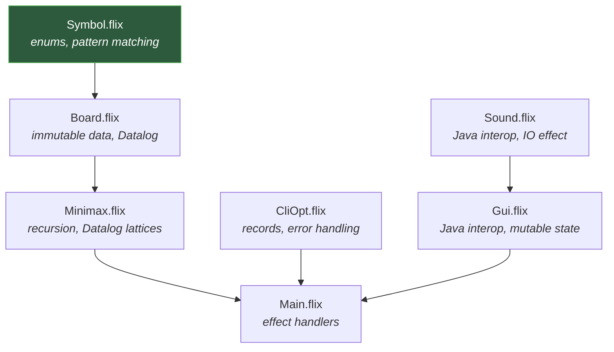
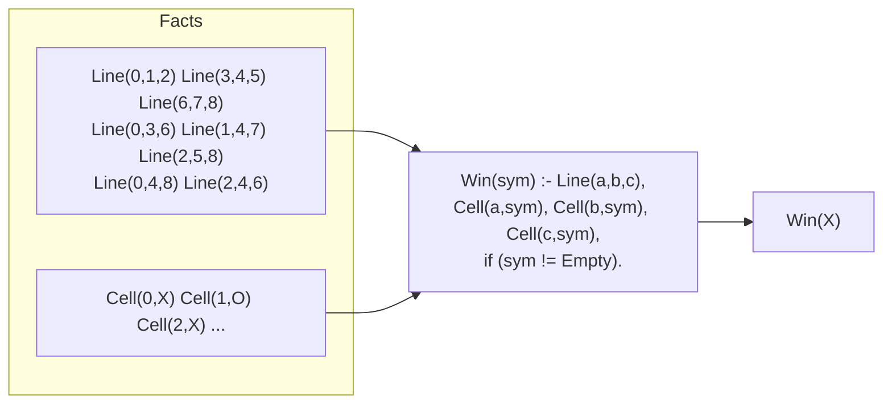
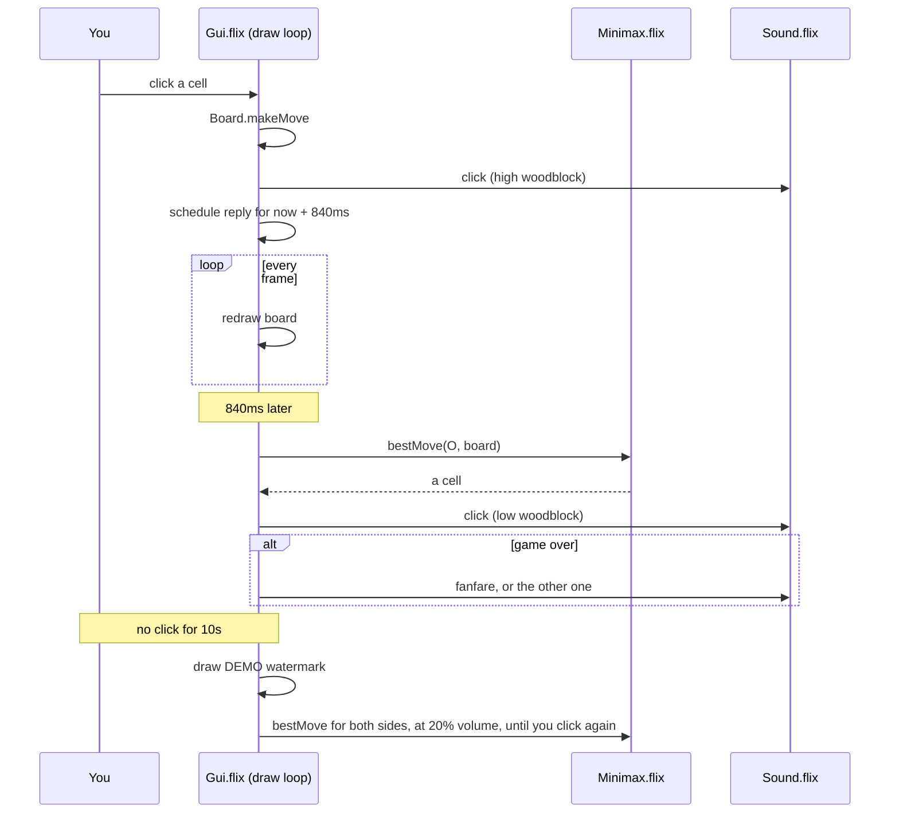

# Tic-Tac-Toe in Flix

A small but complete Flix program: a graphical Tic-Tac-Toe game with an opponent that
cannot be beaten.

It is meant to be read, not just run. Between them, the eight source files cover the
four things you need in order to write real Flix — **the language itself**, **Datalog**,
**Java interop**, and **an interactive program with effects** — at a size you can hold
in your head.

## Where to start reading

Read the files in this order. Each one adds one idea.



| File | What it teaches |
| --- | --- |
| `src/Symbol.flix` | Enums, `match`, deriving `Eq`/`Order`/`ToString`. |
| `src/Board.flix` | Immutable `Vector`, and **the rules of the game written as Datalog**. |
| `src/Minimax.flix` | Recursion, alpha-beta search, and a **Datalog lattice** to pick the best moves. |
| `src/CliOpt.flix` | Records, `Option`, and collecting errors instead of crashing. |
| `src/Sound.flix` | **Java interop** (`javax.sound.midi`), and separating pure data from `IO`. A score is data, so `atVolume` is a one-line `List.map` and can be tested without a speaker. |
| `src/Gui.flix` | **Java interop** (`processing.core`), and an interactive event loop. |
| `src/Opponent.flix` | The smallest file here: one two-case enum. Start by reading it. |
| `src/Main.flix` | **Effect handlers** — where `Sys.Env`, `Sys.Exit` and `Math.Random` are given meaning. |

`Board`, `Minimax`, `CliOpt`, `Gui` and `Sound` each have a matching `test/Test*.flix`.
Reading a test next to its module is often the fastest way to see what the module
promises.

## The idea worth stealing: rules as Datalog

Most languages make you *search* for a win — loop over rows, then columns, then the two
diagonals. Flix lets you instead say **what a win is** and let the engine find it:

```flix
Win(sym) :- Line(a, b, c), Cell(a, sym), Cell(b, sym), Cell(c, sym), if (sym != Symbol.Empty).
```

Read aloud: *someone has won with symbol `sym` if there is a line `a, b, c`, and all
three of those cells hold `sym`, and `sym` is not blank.* The eight winning lines are
just facts:



That is `Board.datalogOutcome`, and it is the whole of the rules of Tic-Tac-Toe.

### Why there is also a second implementation

`Board.outcome` answers the same question with a direct loop. Both are kept, on purpose,
because the trade-off is worth seeing:

- The search calls it **tens of thousands of times per move**. Running the Datalog
  fixpoint that often made the computer's opening move take **66 seconds**; answering
  directly takes **14 milliseconds**.
- But a hand-written loop can drift from the rules it is supposed to implement. So
  `TestBoard.testOutcomeAgreesWithDatalogSpec` runs **both** on **every position a real
  game can reach** and fails if they ever disagree.

The Datalog version is the specification; the loop is the optimisation; the test holds
them together. That pattern is worth more than either half.

## Background: why every demo game looks the same

Leave the demo running and the endings start to repeat. That is not the search
being lazy or the random tie-breaking failing. It is the game.

**Tic-tac-toe is a draw.** With both sides playing perfectly, neither can force a win.
So every demo game is a draw, and a draw fills all nine cells.

**There are exactly 16 drawn final positions.** Of the 126 ways to place five X and four
O on nine cells, only 16 leave neither player with a line.

**Up to rotation and mirroring, there are only three.** A board and its turns are the
same position wearing a different orientation. Collapse them and 16 becomes 3:

```
   O X X          O X O          O O X
   X O O          X O X          X X O
   X O X          X O X          O X X

  8 of 16        4 of 16        4 of 16
```

So roughly half of all drawn games end in the first shape and a quarter in each of the
others — which is why two of them seem to come up constantly.

None of these three numbers is hardcoded. `Board.canonical` collapses a board onto one
representative of its symmetry class, and `TestBoard.testDrawnGamesTakeThreeShapes`
enumerates every drawn ending straight from the rules and checks both counts:

```flix
let draws = finalDraws(Board.newBoard(), Symbol.X, Nil) |> List.toSet |> Set.toList;
Assert.assertEq(expected = 16, List.length(draws));

let shapes = List.map(Board.canonical, draws) |> List.toSet |> Set.toList;
Assert.assertEq(expected = 3, List.length(shapes))
```

### The randomness really is on every move

It would be reasonable to suspect the computer only varies its opening. It does not.
Measured over 200 games, the number of equally-good moves available at each ply:

| Ply | 0 | 1 | 2 | 3 | 4 | 5 | 6 | 7 | 8 |
| --- | --- | --- | --- | --- | --- | --- | --- | --- | --- |
| Average tied options | 9.0 | 2.6 | 6.2 | 2.1 | 1.9 | 1.8 | 1.9 | 1.3 | 1.0 |
| Games with a real choice | 200 | 109 | 200 | 104 | 61 | 66 | 87 | 69 | 0 |

There is a genuine choice right up to the eighth move; only the last is ever forced. And
over those 200 games all 16 drawn positions appeared. The variety is as wide as the game
allows — it is the game that is narrow.

## How a turn actually happens

Processing calls `draw` about thirty times a second. Nothing blocks, so the window never
freezes while the computer thinks.



The 840 ms pause is deliberate. The computer answers instantly, which reads as the board
flickering rather than as an opponent taking a turn. The delay is scheduled by timestamp
rather than by sleeping — sleeping would stop the window redrawing.

**Auto mode.** After ten seconds with no click the game starts playing itself, and
keeps going — clearing and dealing a fresh board between games — until you click again.
A faint "DEMO" is drawn corner to corner across the window, and the sound drops to 20%
so an unattended window is not noisy. It is worth watching once: two perfect players always draw.

Note how auto mode is decided. There is no flag to set and clear, just one timestamp and
a comparison against the clock, so there is no mode to get stuck in:

```flix
let autoMode = now - lastInputTimeRef.get() >= autoModeIdleMs();
```

That one boolean then drives everything the demo does — who moves, how loud it is, and
whether the watermark is drawn — which is why none of those can disagree with each other.

**Buttons.** "New Game" clears the board; "Close" quits. Both are hit-tested with the
same `isInside` helper, and `TestGui` checks that they cannot overlap each other or the
board.

## A trap worth knowing about: MIDI percussion

`Sound.flix` plays its clicks with the *melodic* Woodblock instrument, not with the
percussion channel, and the comment there explains why. General MIDI reserves channel 9
for percussion, which is the obvious place to look for a wood block. It is the wrong
place here: the JVM ships no soundbank, so the synthesizer usually falls back to a
built-in emergency set that has 129 melodic instruments and **no drum kit at all**. Every
percussion key then collapses to the same synthesised noise hit — which sounds like a
snare drum, whatever key you ask for.

This is a good example of the kind of bug you cannot reason your way to. It was found by
asking the synthesizer what it actually had:

```java
Synthesizer s = MidiSystem.getSynthesizer(); s.open();
System.out.println(s.getDefaultSoundbank().getName());   // "Emergency GM sound set"
```

## Running it

```bash
./flixw run          # play
./flixw test         # run the tests
```

### Replaying the same game

When several moves are equally good — most obviously the opening, where all nine are —
the computer picks one at random. Fix the seed and the whole game repeats:

```bash
TICTACTOE_SEED=12345 ./flixw run
```

`flix run` does not forward arguments to the program, so the command-line options in
`CliOpt.flix` only take effect once the game is packaged:

```bash
./flixw build-fatjar
java -jar artifact/tic-tac-toe.jar --seed 12345
java -jar artifact/tic-tac-toe.jar --help
```

The seed is applied once, at the start, so that successive moves draw successive values
from it. Seeding per move instead would make the computer pick the same cell every time.

## Things to try

In rough order of difficulty:

1. Change the colours in `Gui.flix`, or the sounds in `Sound.flix`.
2. Make the board 4×4. How much of `Board.flix` has to change? (Look at `lines()`.)
3. Let the human play as `O` and move second.
4. Add a draw sound — `Sound.drawSound()` already exists but nothing calls it.
5. Make the winning line light up when the game ends. The Datalog rule already knows
   which line won; try returning it instead of just the symbol.
6. Put the tally back on screen: count finished games by shape with `Board.canonical`
   and draw the three miniatures, and watch the proportions settle near 50/25/25.
7. Delete `Board.outcome` and make `datalogOutcome` the only implementation. Measure how
   slow the game becomes, then make it fast again without giving up the Datalog.

## Credits and licence

The original console version of this example was written by
**Gagan Chandan** <gagan@gaganchandan.com>, and the board representation and game loop
still descend from it. Subsequent work — the Datalog rules, the minimax opponent, the
graphical interface, and the sound — by **Werner Stein** <werner.stein@gmail.com>.

This example is part of the Flix repository and is distributed under the
[Apache License 2.0](../../../LICENSE.md), like the rest of it.

> **Dependency licence note.** The graphical interface uses
> [`org.processing:core`](https://processing.org/), which is licensed under the
> **LGPL-2.1**, not Apache-2.0. No Processing code is copied into this repository — it is
> fetched by the build — so the repository itself remains Apache-2.0. But anyone
> redistributing a bundled build of this example (for instance a fat jar) is
> redistributing LGPL code and takes on the LGPL's obligations, in particular the
> requirement that the recipient be able to relink against a modified Processing.
> `javax.sound.midi`, used by `Sound.flix`, is part of the JDK and adds no such
> condition.
